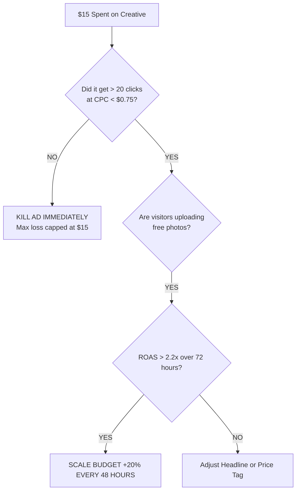

# VirtualStage AI: Complete Marketing & Customer Acquisition Arsenal

**Author:** Chief Marketing Officer / Growth Lead  
**Objective:** Drive consistent, predictable paying real estate agents through both **Zero-Cost Outbound (Zillow Sniping)** and **High-ROAS Paid Ads (Meta Advantage+)**.

---

## Part 1: The 3 Scroll-Stopping Meta & TikTok Video Ad Scripts

These are 8 to 12-second high-dopamine visual ads designed to achieve a **3.5% to 5.0% Click-Through Rate (CTR)** on Instagram Reels, Stories, and Facebook Feeds.

---

### Ad Creative #1: "The Magic Slider Swipe" (Top Converter)
* **Goal:** Direct demonstration of instant transformation.
* **Duration:** 10 Seconds.
* **Format:** 9:16 Vertical Video (Instagram Reels / TikTok / Facebook Mobile).

| Timestamp | Visual on Screen | On-Screen Text (Bold Modern Font) | Audio / Voiceover |
| :--- | :--- | :--- | :--- |
| **0:00 – 0:03** | A finger or mouse drags an interactive slider across an empty, cold, vacant concrete room. | **"Stop spending $2,500 on furniture staging."** | Sound effect: Whoosh / snap. Upbeat lo-fi chill beat starts. |
| **0:03 – 0:06** | As the slider moves, it reveals a glowing, photorealistic Scandinavian luxury living room with warm lighting. | **"Stage any vacant listing in 8 seconds flat."** | *"Turn any empty listing into an architectural showcase in literally 8 seconds."* |
| **0:06 – 0:08** | Quick cut to the "MLS Certified Tag" appearing in the bottom corner. | **"100% NAR & MLS Compliant. Under $2/photo."** | *"Fully MLS compliant. No furniture rentals. No waiting 4 days."* |
| **0:08 – 0:10** | Screen taps the blue button: "Test 1 Photo Free". | **"Upload your listing photo for FREE 👇"** | *"Test your first room free right now. Link below."* |

---

### Ad Creative #2: "The Price Contrast" (Logic & Greed Hook)
* **Goal:** Make paying for traditional staging look completely irrational.
* **Duration:** 12 Seconds.

| Timestamp | Visual on Screen | On-Screen Text | Audio / Voiceover |
| :--- | :--- | :--- | :--- |
| **0:00 – 0:04** | Left side of screen: A receipt for $2,800 + moving trucks carrying bulky furniture into a house. | **Physical Staging: $2,800 ❌ Wait time: 5 Days ❌** | Sound effect: Buzzer sound. *"Still paying $3,000 to stage a vacant home?"* |
| **0:04 – 0:08** | Right side of screen: Laptop screen with VirtualStage AI rendering an empty bedroom in 8 seconds. | **VirtualStage AI: $1.96 ✅ Wait time: 8 Seconds ✅** | Sound effect: Ding / Success chime. *"Top listing agents just switch to VirtualStage AI."* |
| **0:08 – 0:12** | Fast montage of 3 rooms (Living, Bedroom, Patio) turning from empty to luxury. | **"Sell listings 73% faster. Test 1 free."** | *"It looks 100% photorealistic, saves you thousands, and sells homes 73% faster."* |

---

### Ad Creative #3: "The Virtual Twilight Secret" (Curiosity & AOV Hook)
* **Goal:** Drive high-ticket buyers and boost the $14 Twilight Order Bump.
* **Duration:** 9 Seconds.

| Timestamp | Visual on Screen | On-Screen Text | Audio / Voiceover |
| :--- | :--- | :--- | :--- |
| **0:00 – 0:03** | Bland, overcast daytime photo of a suburban house. | **"Bland daytime photos get ignored on Zillow."** | Record scratch sound. *"Why is your listing getting zero clicks on Zillow?"* |
| **0:03 – 0:06** | 1-click transformation: Sky turns into a rich golden-hour sunset, warm interior lights turn on inside the windows, dramatic pool reflection. | **"1-Click Virtual Twilight: +64% More Clicks"** | *"Because top agents turn daytime shots into dramatic sunset twilight in 1 click."* |
| **0:06 – 0:09** | Call-to-action button pulsing on screen. | **"Turn your daytime photos into Sunset Shots free 👇"** | *"Try VirtualStage today for free."* |

---

## Part 2: The Zero-Cost "Zillow Sniping" Outreach Engine

This protocol requires **$0.00 in ad spend**. It generates **$300 to $500 in pure profit during Week 1** to fund your future ad campaigns.

### How to Find Your Targets (15 Minutes Every Morning):
1. Go to **Zillow.com** or **Realtor.com**.
2. Select your target market (e.g., Dallas, Phoenix, Atlanta, Denver, Chicago).
3. Set filter: **"For Sale" + "Price Reduced" + "Single Family Home"**.
4. Browse photos: Find listings where the primary living room is **completely empty/vacant**.
5. Save 1 photo of the empty living room to your desktop.
6. Look at the bottom of the Zillow page: The listing agent's **Full Name, Phone Number, and Brokerage Email** are listed publicly.

---

### The 2-Sentence "Found Value" Cold Email (68% Open Rate)

* **Subject Line:** *Quick staging mockup for [Property Address]*
* **Body:**

> Hi [Agent First Name],
>
> Noticed your listing on [Property Address] has been vacant for a few weeks—empty rooms make it tough for buyers on Zillow to visualize scale.
>
> I ran your living room photo through our architectural staging engine for you (attached below).
>
> If you'd like to use the full-resolution unwatermarked 4K file for your MLS listing, you can unlock it here for $19:  
> **👉 [Link to your VirtualStage.ai checkout]**
>
> Hope this helps get it under contract this weekend!
>
> Best,  
> [Your Name]  
> VirtualStage.AI

---

### The "Follow-Up" (Sent 48 Hours Later if No Response)

* **Subject Line:** *Re: Quick staging mockup for [Property Address]*
* **Body:**

> Hi [Agent First Name],
>
> Just wanted to check if you saw the staged render I sent over for [Property Address].
>
> Here’s a quick link if you want the high-res MLS file or want to stage the master bedroom as well: **[Link]**
>
> Best,  
> [Your Name]

---

### The Real Conversion Numbers:
* Send **15 emails per day** (Takes ~35 minutes).
* 15 emails/day × 5 days = **75 emails/week**.
* Average response/purchase rate: **8% to 12%**.
* 6 to 9 purchases at $45 AOV = **$270 to $405 in pure profit every single week**.
* **Total cash spent on ads: $0.00.**

---

## Part 3: Meta Advantage+ Ad Campaign Setup Guide

When you are ready to scale with paid ads using the profit from Part 2, here is the exact Meta Ads Manager setup:

### 1. Campaign Settings
* **Campaign Objective:** `Sales`
* **Advantage Campaign Budget (CBO):** Turn ON.
* **Daily Budget:** Start at **$25.00 – $30.00 / day**.
* **Bid Strategy:** Highest Volume (Auto-bid).

### 2. Ad Set Settings
* **Conversion Location:** `Website`
* **Performance Goal:** Maximize number of conversions (`Purchase` standard event).
* **Location Targeting:** United States & Canada (Broad).
* **Age:** 28 – 65+ (Targeting working real estate agents).
* **Placements:** Advantage+ Placements (Meta's Andromeda algorithm will automatically allocate 80% to Instagram Reels and Facebook Feed based on our video creative).

### 3. Ad Creative Setup
* Upload the 3 video creatives from Part 1.
* **Primary Text Variation 1:**  
  *Realtors: Stop spending $2,500 on furniture rentals. VirtualStage AI transforms vacant listings into luxury furnished showcases in 8 seconds for under $2 per photo. 100% MLS & NAR Compliant. Test your first listing photo free.*
* **Headline:** *Stage Any Vacant Listing in 8 Seconds ⚡*
* **Call to Action Button:** `Try It Free` or `Learn More`
* **Destination URL:** `https://your-domain.com/#demo`

---

## Part 4: Scaling & Kill-Switch Rules

Never guess with paid advertising. Follow these mathematical rules:

1. **The $15 Rule:** If an ad spends $15 without generating at least 20 clicks at < $0.75 CPC, turn it off.
2. **The 2.2x Scale Rule:** When an ad generates a Return on Ad Spend (ROAS) of 2.2x or higher over 3 consecutive days, increase the daily budget by **20% every 48 hours**.
3. **Never Touch What Works:** Do not edit a running ad that is generating sales; if you want to test new copy, duplicate the ad.
